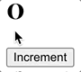
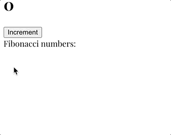
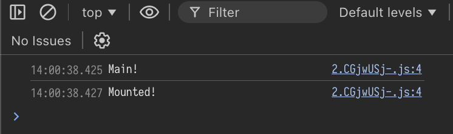

# Using other languages in Svelte

## Intro

Svelte already supports JavaScript and TypeScript, through an attribute of the `script` tag:

```html
<script lang="ts">
    ...
</script>
```

I thought: "What would it take to support other languages?"

And so, my quest started. I thought I'd try Scala as a first attempt and called this project "Svala" (hilarious, I know).

R&D goals:
1. Scala directly in a Svelte file
2. Real Svelte reactivity
3. Imports from other Scala files
4. Imports from JS/TS libraries

Untested, not working, future improvements:
- Svelte 5 Runes support (`$props`, `$state`, etc.)
- Legacy props parameters (`export let ...`)

## Results

### The bad

It works, but it's not very nice to develop with:
- Live mode doesn't work, only full builds, so the dev experience has a slow feedback loop
- Hard to debug, no source maps, opaque compilation
- Syntax highlighters are not expecting Scala code in Svelte files so it's all red
- Clunky UX: needs a lot of annotations (but that's already the ScalaJS experience)

### The good

On the other hand, it works! It feels kind of magic, like it shouldn't really work:

```html
<script lang="scala">
    import scala.scalajs.js.annotation._
    import lib.fibonacci
    import lib.svelte.onMount

    @JSExportTopLevel("a")
    var a: Int = 0

    @JSExportTopLevel("inc")
    def inc(): Unit = {
      a += 1
    }

    @JSExportTopLevel("fib")
    def fib(n: Int) = fibonacci(n).mkString(" - ")

    @main def main() =
      println("Main!")
      onMount(() => println("Mounted!"))
</script>

<h1>{a}</h1>
<button on:click={_ => inc()}>Increment</button>
<div>Fibonacci numbers: {fib(a)}</div>
```

In the above component, we have a demo of all the goal features we wanted:

1. Scala directly in a Svelte file:

    Using a custom pre-processor (in `svelte.config.js`), we are feeding the tag's code into a temporary Scala file, and then running SBT to compile all source files + that temporary file into a JS bundle, which then replaces the script tag and regular Svelte compilation occurs.

    However this means that _**each Svelte file**_ will contain _**the whole ScalaJS runtime, Scala standard library (tree-shaken), all the user defined libs in its code**_.

    Some post-processing of the pre-processor was necessary:
    - ScalaJS' internal names all contain dollar signs `$` and prefixing names with that is reserved for Svelte, so Svelte compilation fails,
    - ScalaJS was written with a bunch of `var` instead of `let`, and defining two `var` with the same name causes a compilation error.

2. Real Svelte reactivity:

    This is achieved using legacy reactivity (as opposed to Svelte 5's modern way of using `$props`) just using javascript variables and referring to their name in the Svelte part.

    However, this won't work out-of-the-box because ScalaJS mangles all names, and in our above example, `inc()` and `a` would become `$e_inc` and `$t_LScript$package$__a` respectrively.

    This can be achieved by doing even more post-processing in the pre-processor, and using some ScalaJS annoation features.

    Any variable or function that needs to be referred from the Svelte side needs to be declared as `@JSExportTopLevel("name")`, and then the post-processor will find the generated exports (e.g. `export { $t_LScript$package$__a as a }`) and use that as a mapping to replace all mangled names with their original names, letting Svelte use them in the global scope.

    <p align="center">
    
    <br>
    <em>It works!</em>
    </p>

3. Imports from other Scala files:

    In the above example, we do `import lib.fibonacci`, which refers to a totally vanilla Scala package and function in `lib/fibonacci.scala`:

    ```scala
    package lib

    import scala.annotation.tailrec

    def fibonacci(sequenceSize: Int): Seq[Long] =

        @tailrec
        def fib(n: Int, a: Long, b: Long, acc: List[Long]): List[Long] =
            if (n <= 0) acc
            else fib(n - 1, b, a + b, acc :+ a)

        fib(sequenceSize, 0L, 1, Nil)
    ```

    We can then call it in our Svelte component:

    ```scala
    @JSExportTopLevel("fib")
    def fib(n: Int) = fibonacci(n).mkString(" - ")
    ```

    And call use that to render some reactive text:

    ```html
    <div>Fibonacci numbers: {fib(a)}</div>
    ```

    <p align="center">
    
    <br>
    <em>It works!</em>
    </p>

4. Imports from JS/TS libraries:

    For this, the standard ScalaJS workflow works as it should. Basically we need to implement stubs for all the functions and objects we want to use from external libraries, define their types etc. and import that in our Svelte component, where we can use them as if they were native.

    To try it out, here's a very short stub for Svelte's `onMount` function, placed in `lib/svelte/lifecycle.scala`:

    ```scala
    package lib.svelte

    import scala.scalajs.js
    import scala.scalajs.js.annotation._

    @js.native
    @JSImport("svelte", "onMount")
    def onMount(f: js.Function0[Unit]): Unit = js.native
    ```

    Above, we do the following:
    - Declare a function `onMount` with JS types for the arguments and returns (important, because decalring `f: () => Unit` will crash at runtime)
    - Decorate it as `@js.native`
    - Tell ScalaJS that in the generated code, this should be an `import { onMount } from "svelte"` with the `@JSImport` annotation

    We can now import and use it in our Svelte component:

    ```scala
    import lib.svelte.onMount

    @main def main() =
      println("Main!")
      onMount(() => println("Mounted!"))
    ```

    Because SBT is set up to also export a main function that gets automatically called in the JS world, our code gets executed correctly and the native `onMount` function from Svelte is called:

    <p align="center">
    
    <br>
    <em>It works!</em>
    </p>

## Conclusion

It works!

<sub><sub><em>(But it's so weird!)</em></sub></sub>
